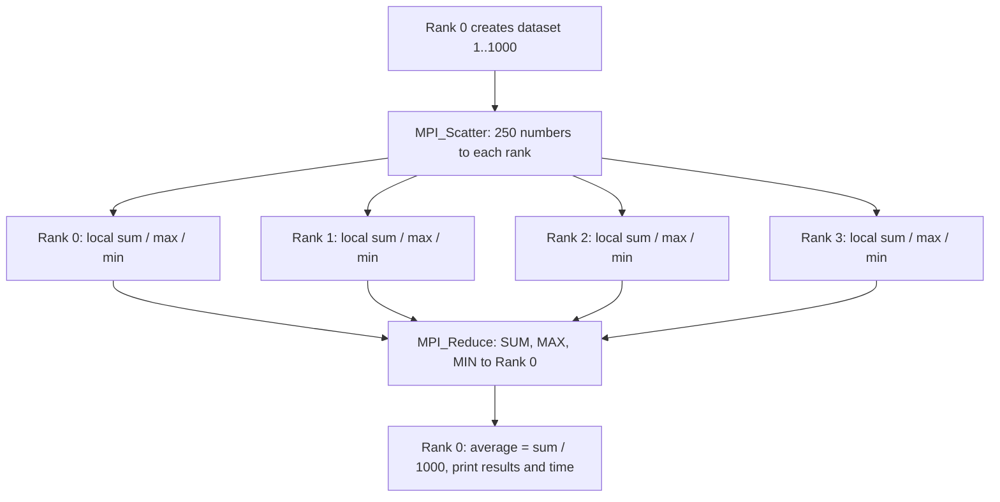
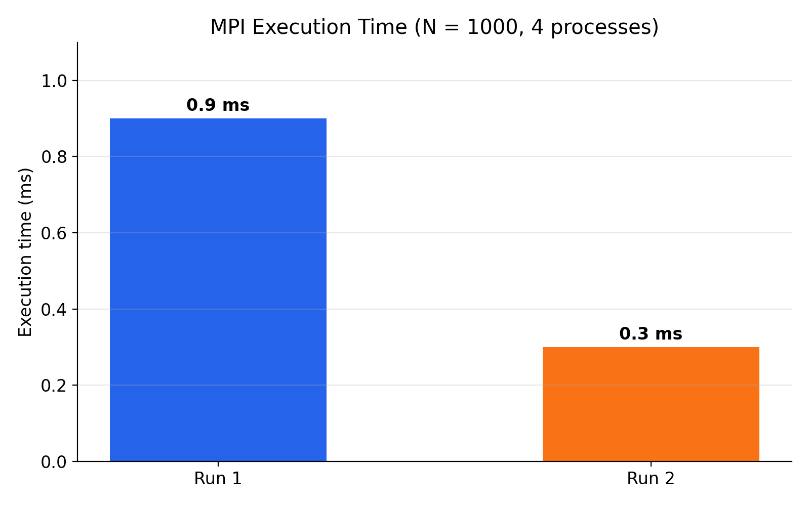
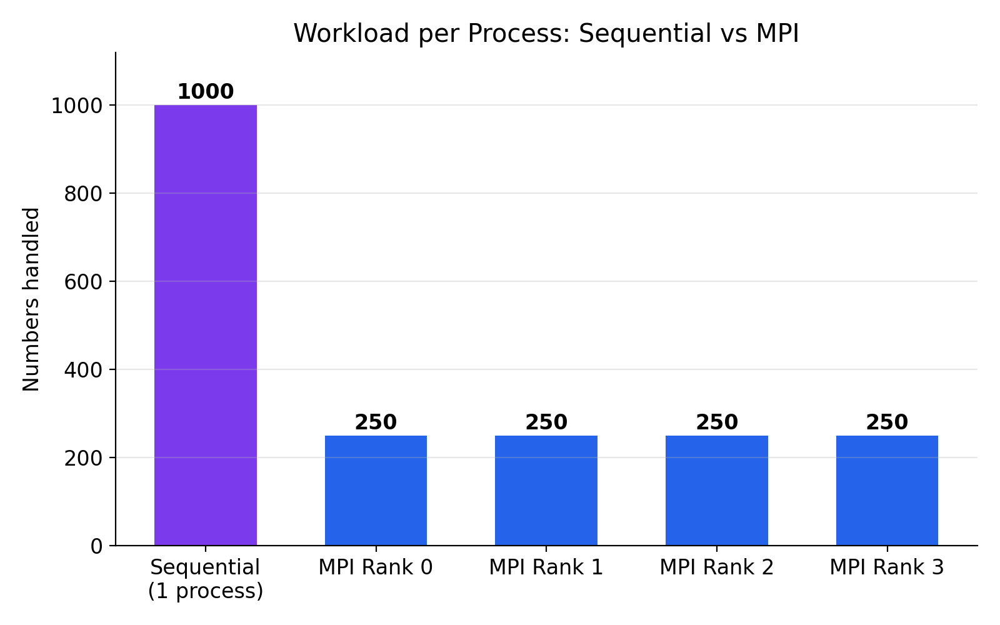
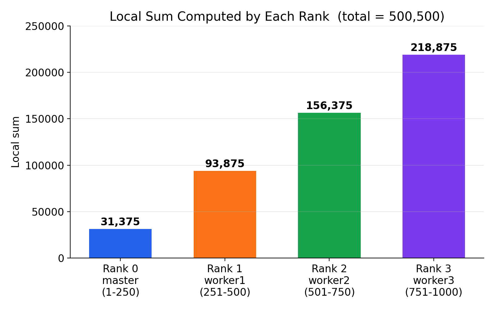

<div align="center">

# 🌐 Distributed Dataset Statistics using MPI

### Sum · Average · Maximum · Minimum — computed in parallel across a Master + 3 Worker cluster


**Parallel and Grid Computing (PGC) — Lab Evaluation · Theme 6 · Team B1-6**

</div>

---

## ✨ At a Glance

| | |
|---|---|
| 🎓 **Course** | Parallel and Grid Computing (PGC) – Lab Evaluation |
| 🧩 **Theme** | 6 – Distributed Dataset Statistics |
| ⚙️ **Parallel model** | MPI (Message Passing Interface) |
| 📦 **Dataset** | N = 1000 integers (1 … 1000) |
| 🖥️ **Cluster** | 1 Master + 3 Worker VMs → **4 MPI processes** |
| 🎯 **Result** | Sum = **500500**, Average = **500.50**, Max = **1000**, Min = **1** |
| ⏱️ **MPI time** | **0.3 – 0.9 ms** |

### 👥 Team

| Name | Roll No. |
|---|:---:|
| Chaitanya M | 226 |
| Divya | 226 |
| Shridevi | 230 |
| Vineet K | 221 |

---

## 📑 Table of Contents

1. [Objective](#-objective)
2. [How It Works](#-how-it-works)
3. [Problem Definition](#-problem-definition)
4. [Algorithms](#-algorithms)
5. [Cluster Setup](#-cluster-setup)
6. [Repository Structure](#-repository-structure)
7. [Build & Run](#-build--run)
8. [Output](#-output)
9. [Results & Graphs](#-results--graphs)
10. [Analysis](#-analysis)
11. [Troubleshooting](#-troubleshooting)
12. [Checkpoint Mapping](#-checkpoint-mapping)
13. [Conclusion](#-conclusion)

---

## 🎯 Objective

Calculate the **sum, average, maximum and minimum** of a dataset of **1000 numbers** using **4 MPI processes** on one Master and three Worker VMs, and compare the parallel result and workload with the sequential version.

---

## 💡 How It Works

When a dataset is large, one computer takes a long time to process it. The idea:

1. **Divide** the data into equal parts.
2. Give each part to a **different process**.
3. All processes work **at the same time**.
4. **Combine** the partial answers into the final answer.

**MPI** lets processes (on one or many computers) communicate by sending messages. Each process has a number called its **rank** (0, 1, 2, 3). **Rank 0 is the master**: it holds the data, sends parts to the others and collects the results. Every process has its **own memory**, so data must be sent explicitly.

---

## 📋 Problem Definition

- **Input:** N = 1000 integers `1, 2, 3, …, 1000`
- **Output:** Sum, Average (= Sum / N), Maximum, Minimum
- **Goal:** compute them with 4 MPI processes and confirm the answer equals the sequential answer

Expected values from the formula: Sum = 1000 × 1001 / 2 = **500500**, Average = **500.50**, Max = **1000**, Min = **1**.

---

## 🧠 Algorithms

### Sequential

```text
sum = 0; max = min = first element
for each number x in the dataset:
    sum = sum + x
    if x > max: max = x
    if x < min: min = x
average = sum / N
```

Time complexity: **O(N)** — one process does all the work.

### Parallel (MPI)



1. Initialise MPI, get rank and number of processes
2. Rank 0 creates the dataset
3. **`MPI_Scatter`** — each process gets 1000 / 4 = **250** numbers
4. Each process finds the sum, max and min of its own block
5. **`MPI_Reduce`** (`MPI_SUM`, `MPI_MAX`, `MPI_MIN`) collects partial results at rank 0
6. Rank 0 computes the average, prints the statistics and execution time
7. Finalise MPI

### MPI functions used

| Function | Purpose |
|---|---|
| `MPI_Init` / `MPI_Finalize` | Start and end the MPI environment |
| `MPI_Comm_rank` / `MPI_Comm_size` | Get the rank and number of processes |
| `MPI_Scatter` | Divide the dataset equally among all processes |
| `MPI_Reduce` | Combine partial sum, max and min at rank 0 |
| `MPI_Wtime` | Measure execution time |

### Work done by each process

| Rank | Node | Numbers received | Count | Local sum |
|:---:|---|:---:|:---:|:---:|
| 0 | master | 1 – 250 | 250 | 31,375 |
| 1 | worker1 | 251 – 500 | 250 | 93,875 |
| 2 | worker2 | 501 – 750 | 250 | 156,375 |
| 3 | worker3 | 751 – 1000 | 250 | 218,875 |
| **Total** | | | **1000** | **500,500** |

> 31375 + 93875 + 156375 + 218875 = **500500** ✅

---

## 🖥️ Cluster Setup

### Requirements

- VMware Workstation (or similar)
- Four Ubuntu VMs (1 Master + 3 Workers) on the same virtual network
- OpenSSH Server and Open MPI on all nodes
- Passwordless SSH from Master to all Workers

### Cluster details

| Node | Hostname | IP Address | MPI Rank |
|---|---|---|:---:|
| Master | master | 192.168.125.128 | 0 |
| Worker 1 | worker1 | 192.168.125.129 | 1 |
| Worker 2 | worker2 | 192.168.125.130 | 2 |
| Worker 3 | worker3 | 192.168.125.131 | 3 |

| Item | Details |
|---|---|
| OS | Ubuntu (VMware virtual machines) |
| MPI library | Open MPI (`openmpi-bin`, `libopenmpi-dev`) |
| Compiler | `mpicc` (C) |
| Processes | 4 (one per VM) |
| Hostfile | `hosts` |

<details>
<summary><b>🔧 Click to expand: step-by-step setup</b></summary>

**1. Set a unique hostname (on each VM, its own name only)**
```bash
sudo hostnamectl set-hostname master     # worker1 / worker2 / worker3 on the others
```

**2. Find each VM's IP**
```bash
hostname -I
```

**3. Test connectivity (on Master)**
```bash
ping -c 4 192.168.125.129
ping -c 4 192.168.125.130
ping -c 4 192.168.125.131
```
Expected: 4 packets sent, 4 received, 0% loss.

**4. Install SSH on every VM**
```bash
sudo apt update
sudo apt install openssh-server -y
sudo systemctl enable --now ssh
```

**5. Install Open MPI on every VM**
```bash
sudo apt install openmpi-bin libopenmpi-dev -y
```

**6. Verify**
```bash
mpicc --version
mpirun --version
```

**7. Create an SSH key on Master**
```bash
ssh-keygen -t rsa
```

**8. Copy the key to the Workers**
```bash
ssh-copy-id worker1
ssh-copy-id worker2
ssh-copy-id worker3
```

**9. Test passwordless SSH**
```bash
ssh worker1 hostname
ssh worker2 hostname
ssh worker3 hostname
```
Expected: `worker1`, `worker2`, `worker3` with no password prompt.

**10. Create the working directory and hostfile (on Master)**
```bash
mkdir -p ~/parallel_lab/mpi
cd ~/parallel_lab/mpi
nano hosts
```
Contents of `hosts`:
```text
master slots=1
worker1 slots=1
worker2 slots=1
worker3 slots=1
```
`slots=1` means one process per machine.

</details>

---

## 📁 Repository Structure

```text
.
├── README.md
├── src/
│   ├── dataset_stats_sequential.c       # Sequential version (N = 1000)
│   └── dataset_stats_parallel_mpi.c     # MPI parallel version
├── data/
│   └── dataset.txt                      # Dataset (numbers 1..1000)
├── results/
│   └── output.txt                       # Program output
├── graphs/
│   ├── mpi_execution_time.png
│   ├── work_per_process.png
│   └── local_sum_per_rank.png
├── report/                              # Report
└── presentation/
    └── Distributed_Dataset_Statistics_MPI.pptx
```

---

## 🚀 Build & Run

All commands run on the **Master VM** inside `~/parallel_lab/mpi`.

**1. Compile**
```bash
mpicc -O2 src/dataset_stats_parallel_mpi.c -o dataset_stats
```

**2. Copy the executable to every Worker**
```bash
scp dataset_stats worker1:~/dataset_stats
scp dataset_stats worker2:~/dataset_stats
scp dataset_stats worker3:~/dataset_stats
```

**3. Run on the cluster (4 processes)**
```bash
mpirun -np 4 --hostfile hosts sh -c '$HOME/dataset_stats'
```

**4. Sequential version**
```bash
gcc src/dataset_stats_sequential.c -o dataset_stats_sequential
./dataset_stats_sequential
```

**5. Quick test on a single machine**
```bash
mpirun -np 4 ./dataset_stats
```

> If Open MPI refuses to run as root, use a normal user. Do not disable the safety checks.

<details>
<summary><b>📄 Sequential source code</b></summary>

```c
#include <stdio.h>
int main() {
    int n = 1000;
    long long sum = 0;
    int max = 1, min = 1;
    for (int i = 1; i <= n; i++) {
        sum += i;
        if (i > max) max = i;
        if (i < min) min = i;
    }
    double average = (double)sum / n;
    printf("Sequential Dataset Statistics\n");
    printf("Dataset Size = %d\n", n);
    printf("Sum = %lld\n", sum);
    printf("Average = %.2f\n", average);
    printf("Maximum = %d\n", max);
    printf("Minimum = %d\n", min);
    return 0;
}
```

The MPI program is in [`src/dataset_stats_parallel_mpi.c`](src/dataset_stats_parallel_mpi.c).

</details>

---

## 🖨️ Output

**Sequential**
```text
Sequential Dataset Statistics
Dataset Size = 1000
Sum = 500500
Average = 500.50
Maximum = 1000
Minimum = 1
```

**MPI — 4 processes on Master + 3 Workers**
```text
===== Distributed Dataset Statistics =====
Dataset Size : 1000
MPI Processes: 4
Sum          : 500500
Average      : 500.50
Maximum      : 1000
Minimum      : 1
Execution Time: 0.0003 seconds
==========================================
```

---

## 📊 Results & Graphs

### ✅ Correctness

| Quantity | Formula / Expected | Sequential | MPI (4 processes) | Match |
|---|---|:---:|:---:|:---:|
| Sum | 1000 × 1001 / 2 | 500500 | 500500 | ✅ |
| Average | 500500 / 1000 | 500.50 | 500.50 | ✅ |
| Maximum | N | 1000 | 1000 | ✅ |
| Minimum | 1 | 1 | 1 | ✅ |

The parallel output is **identical** to the sequential output and to the formula.

### ⏱️ MPI execution time

| Run | Time |
|:---:|:---:|
| Run 1 | 0.0009 s (0.9 ms) |
| Run 2 | 0.0003 s (0.3 ms) |



### ⚖️ Workload comparison

| Version | Processes | Numbers per process |
|---|:---:|:---:|
| Sequential | 1 | 1000 |
| MPI parallel | 4 | **250** |

Each MPI process does **4× less work** than the sequential process.



### 🧮 Local sum per rank



### 🚀 Speedup & efficiency

Speedup = T(sequential) / T(parallel), and Efficiency = Speedup / 4.

The sequential program did not print its execution time and was run on a different system (Windows WSL) from the MPI cluster (Ubuntu VMs), so a fair speedup value is **not calculated here**. To get one, time the sequential program on the Master VM and fill in:

| T(sequential) | T(parallel, 4 processes) | Speedup | Efficiency |
|:---:|:---:|:---:|:---:|
| *measure on master VM* | 0.0003 s (best run) | — | — |

---

## 🔍 Analysis

- The 1000 numbers are split equally, so every process has the **same workload** (250) — the load is **balanced**.
- Each process uses only its own memory. Data moves only through `MPI_Scatter` and `MPI_Reduce`, and each process sends back just three small values (sum, max, min).
- The MPI time changed between runs (0.9 ms vs 0.3 ms), showing that at this size the time is mostly **communication and network overhead** between VMs.
- For N = 1000 the calculation itself takes only microseconds, so communication costs more than computation. A large speedup is **not expected** here; parallelism pays off on **much larger datasets**.
- `MPI_Reduce` is efficient because rank 0 combines only a few partial answers instead of receiving every number.

---

## 🛠️ Troubleshooting

| Problem | Explanation / Fix |
|---|---|
| `Authorization required, but no authorization protocol specified` (many times) | A display (X11 / GUI) warning from the VM. It does **not** affect the MPI computation; the final output is still correct. |
| `mpirun` cannot reach workers | Check passwordless SSH and the names in `hosts`. |
| Executable not found on a worker | Copy it again with `scp`. |
| Open MPI refuses to run as root | Run as a normal user. |

---

## 🗺️ Checkpoint Mapping

| Checkpoint | Work | Where |
|:---:|---|---|
| 1 | Problem definition, sequential algorithm, parallel design | Problem Definition, Algorithms |
| 2 | Working parallel implementation (MPI) | `src/`, Cluster Setup, Build & Run |
| 3 | Run and collect results | Output, Results, `results/` |
| 4 | Graphs and analysis | `graphs/`, Results & Graphs, Analysis |
| 5 | Final demonstration and viva | `presentation/` |

---

## ✅ Conclusion

The program computes the sum, average, maximum and minimum of 1000 numbers using **4 MPI processes** on one Master and three Worker VMs. Data was divided with `MPI_Scatter` (250 numbers per process) and combined with `MPI_Reduce`.

The result — **Sum = 500500, Average = 500.50, Max = 1000, Min = 1** — matches the sequential program and the formula. Each process does four times less work than the sequential version. At this small size, communication overhead dominates execution time (0.3 – 0.9 ms), so larger datasets are needed to show real speedup.

---

<div align="center">

Made with ☕ and MPI by **Team B1-6** · [chaitanya-m5](https://github.com/chaitanya-m5)

⭐ If you found this helpful, consider starring the repo!

</div>
